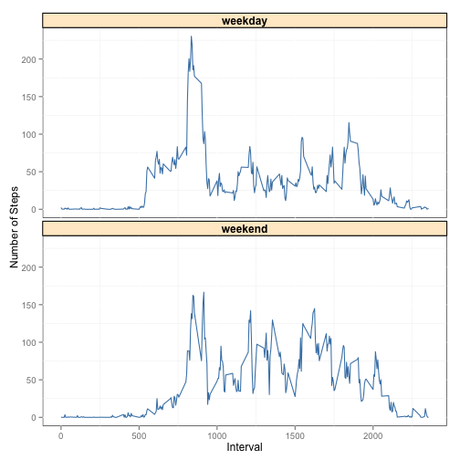

The purpose of this document is to share the details for Peer Assignment 1 (Reproducible Research) in coursera.

Naming Conventions:

1. The names for internal usage tables are all in lowercase and separated with _ i.e. **tidy_data**.
2. Column names are all UpperCase for first alphabets of each meaning except the first i.e. meanSteps. All spaces and symbols are also removed from them.

## Loading and preprocessing the data
Requirements:

Show any code that is needed to

1. Load the data (i.e. read.csv())
2. Process/transform the data (if necessary) into a format suitable for your
analysis

Processing Steps:

1. Check if "activity.csv" has been extracted, if not extract it.
2. Read "activity.csv" with stringAsFactors=FALSE into **activity**
3. After reading in, convert date field into Date format.


```r
#check if file exists, if no, unzip
if(!file.exists("activity.csv")){
  unzip("activity.zip")
}

#read in the file with stringAsFactors=FALSE
#convert date into date format
activity<-read.csv("activity.csv",stringsAsFactors=F)
activity$date<-as.Date(activity$date,"%Y-%m-%d")
```

## What is mean total number of steps taken per day?

For this part of the assignment, you can ignore the missing values in the dataset.

1. Make a histogram of the total number of steps taken each day
2. Calculate and report the mean and median total number of steps taken per day

Processing Steps:

1. Filter for complete cases and store the clean data without NA into **clean_activity**


```r
#check for complete cases in activity
#assign those with value and without NA into clean_activity
clean_activity<-activity[complete.cases(activity),]
```

2. Call library dplyr for easy processing and ggplot2 for plotting.


```r
#use library dplyr for grouping and summing and ggplot2 for plotting
library(dplyr)
library(ggplot2)
```

3. Group **clean_activity** by date and get total number of steps per date. Store it into **grouped_by_date**


```r
#group clean_activity by date and get totalSteps per date
grouped_by_date<-
clean_activity %>%
  group_by(date) %>%
  summarize(totalSteps=sum(steps))
```

4. Make a histogram of total number of steps taken each day using **grouped_by_date**


```r
#drawing histogram to see frequency of total steps
hist(grouped_by_date$totalSteps,main="Histogram of Total Steps",xlab="Total Number of Steps")
```

 

5. Get Mean and median of total number of steps taken per day


```r
#mean of total steps
mean(grouped_by_date$totalSteps)
```

```
## [1] 10766.19
```

```r
#median of total steps
median(grouped_by_date$totalSteps)
```

```
## [1] 10765
```

## What is the average daily activity pattern?

Requirements:

1. Make a time series plot (i.e. type = "l") of the 5-minute interval (x-axis) and the average number of steps taken, averaged across all days (y-axis)
2. Which 5-minute interval, on average across all the days in the dataset, contains the maximum number of steps?

Processing Steps:

1. Group **clean_activity** by interval and find mean steps per interval. Store the result into **grouped_by_interval**.


```r
#group clean_activity by interval and calculate average steps per interval across all days
grouped_by_interval<-
  clean_activity %>%
  group_by(interval) %>%
  summarize(averageSteps=mean(steps))
```

2. Use ggplot2 and plot a time series plot of average steps across interval.


```r
#plot time-interval graph
ggplot(grouped_by_interval,aes(x=interval,y=averageSteps,group=1)) + 
  geom_line() + 
  labs(title="Average Daily Activity Pattern") + 
  labs(y="Average Activity",x="Interval") + 
  theme(title=element_text(size=14,face="bold"))
```

 

3. Get the interval with max average from **grouped_by_interval**.


```r
#get the interval with max average daily activity pattern
grouped_by_interval[grouped_by_interval$averageSteps==max(grouped_by_interval$averageSteps),]$interval
```

```
## [1] 835
```

## Imputing missing values

Requirements:

Note that there are a number of days/intervals where there are missing values (coded as NA). The presence of missing days may introduce bias into some calculations or summaries of the data.

1. Calculate and report the total number of missing values in the dataset
(i.e. the total number of rows with NAs)
2. Devise a strategy for filling in all of the missing values in the dataset. The strategy does not need to be sophisticated. For example, you could use the mean/median for that day, or the mean for that 5-minute interval, etc.
3. Create a new dataset that is equal to the original dataset but with the missing data filled in.
4. Make a histogram of the total number of steps taken each day and Calculate and report the mean and median total number of steps taken per day. Do these values differ from the estimates from the first part of the assignment? What is the impact of imputing missing data on the estimates of the total daily number of steps?

Processing Steps:

1. Find and store cases with NA into **na_activity**


```r
#finding those cases with "NA"
na_activity<-activity[!complete.cases(activity),c("interval","date")]
```

2. Use nrow to find the number of NAs inside the dataset **na_activity**


```r
#report the number of cases with NA as readings
nrow(na_activity)
```

```
## [1] 2304
```

3. To devise a strategy, do a rough examination of the dataset. 
- It can be seen that there is no overlap of the dates between NA cases and complete cases. 
- The interval of the NA cases dataset also covers all intervals.
- As such, proposed strategy to adopt is to use the mean steps for the interval to fill up the NA values.


```r
#from a rough tabling of the dataset, it can be seen that
#NA cases belong to specific dates and are across all intervals
#hence proposed strategy is to use the mean of the steps for the interval
#to fill up the na values
table(na_activity$date)
```

```
## 
## 2012-10-01 2012-10-08 2012-11-01 2012-11-04 2012-11-09 2012-11-10 
##        288        288        288        288        288        288 
## 2012-11-14 2012-11-30 
##        288        288
```

```r
table(clean_activity$date)
```

```
## 
## 2012-10-02 2012-10-03 2012-10-04 2012-10-05 2012-10-06 2012-10-07 
##        288        288        288        288        288        288 
## 2012-10-09 2012-10-10 2012-10-11 2012-10-12 2012-10-13 2012-10-14 
##        288        288        288        288        288        288 
## 2012-10-15 2012-10-16 2012-10-17 2012-10-18 2012-10-19 2012-10-20 
##        288        288        288        288        288        288 
## 2012-10-21 2012-10-22 2012-10-23 2012-10-24 2012-10-25 2012-10-26 
##        288        288        288        288        288        288 
## 2012-10-27 2012-10-28 2012-10-29 2012-10-30 2012-10-31 2012-11-02 
##        288        288        288        288        288        288 
## 2012-11-03 2012-11-05 2012-11-06 2012-11-07 2012-11-08 2012-11-11 
##        288        288        288        288        288        288 
## 2012-11-12 2012-11-13 2012-11-15 2012-11-16 2012-11-17 2012-11-18 
##        288        288        288        288        288        288 
## 2012-11-19 2012-11-20 2012-11-21 2012-11-22 2012-11-23 2012-11-24 
##        288        288        288        288        288        288 
## 2012-11-25 2012-11-26 2012-11-27 2012-11-28 2012-11-29 
##        288        288        288        288        288
```

```r
table(na_activity$interval)
```

```
## 
##    0    5   10   15   20   25   30   35   40   45   50   55  100  105  110 
##    8    8    8    8    8    8    8    8    8    8    8    8    8    8    8 
##  115  120  125  130  135  140  145  150  155  200  205  210  215  220  225 
##    8    8    8    8    8    8    8    8    8    8    8    8    8    8    8 
##  230  235  240  245  250  255  300  305  310  315  320  325  330  335  340 
##    8    8    8    8    8    8    8    8    8    8    8    8    8    8    8 
##  345  350  355  400  405  410  415  420  425  430  435  440  445  450  455 
##    8    8    8    8    8    8    8    8    8    8    8    8    8    8    8 
##  500  505  510  515  520  525  530  535  540  545  550  555  600  605  610 
##    8    8    8    8    8    8    8    8    8    8    8    8    8    8    8 
##  615  620  625  630  635  640  645  650  655  700  705  710  715  720  725 
##    8    8    8    8    8    8    8    8    8    8    8    8    8    8    8 
##  730  735  740  745  750  755  800  805  810  815  820  825  830  835  840 
##    8    8    8    8    8    8    8    8    8    8    8    8    8    8    8 
##  845  850  855  900  905  910  915  920  925  930  935  940  945  950  955 
##    8    8    8    8    8    8    8    8    8    8    8    8    8    8    8 
## 1000 1005 1010 1015 1020 1025 1030 1035 1040 1045 1050 1055 1100 1105 1110 
##    8    8    8    8    8    8    8    8    8    8    8    8    8    8    8 
## 1115 1120 1125 1130 1135 1140 1145 1150 1155 1200 1205 1210 1215 1220 1225 
##    8    8    8    8    8    8    8    8    8    8    8    8    8    8    8 
## 1230 1235 1240 1245 1250 1255 1300 1305 1310 1315 1320 1325 1330 1335 1340 
##    8    8    8    8    8    8    8    8    8    8    8    8    8    8    8 
## 1345 1350 1355 1400 1405 1410 1415 1420 1425 1430 1435 1440 1445 1450 1455 
##    8    8    8    8    8    8    8    8    8    8    8    8    8    8    8 
## 1500 1505 1510 1515 1520 1525 1530 1535 1540 1545 1550 1555 1600 1605 1610 
##    8    8    8    8    8    8    8    8    8    8    8    8    8    8    8 
## 1615 1620 1625 1630 1635 1640 1645 1650 1655 1700 1705 1710 1715 1720 1725 
##    8    8    8    8    8    8    8    8    8    8    8    8    8    8    8 
## 1730 1735 1740 1745 1750 1755 1800 1805 1810 1815 1820 1825 1830 1835 1840 
##    8    8    8    8    8    8    8    8    8    8    8    8    8    8    8 
## 1845 1850 1855 1900 1905 1910 1915 1920 1925 1930 1935 1940 1945 1950 1955 
##    8    8    8    8    8    8    8    8    8    8    8    8    8    8    8 
## 2000 2005 2010 2015 2020 2025 2030 2035 2040 2045 2050 2055 2100 2105 2110 
##    8    8    8    8    8    8    8    8    8    8    8    8    8    8    8 
## 2115 2120 2125 2130 2135 2140 2145 2150 2155 2200 2205 2210 2215 2220 2225 
##    8    8    8    8    8    8    8    8    8    8    8    8    8    8    8 
## 2230 2235 2240 2245 2250 2255 2300 2305 2310 2315 2320 2325 2330 2335 2340 
##    8    8    8    8    8    8    8    8    8    8    8    8    8    8    8 
## 2345 2350 2355 
##    8    8    8
```

4. Group **clean_activity** by interval and get the mean steps per interval. This **average_by_interval_clean** will be the basis for inputing in the NA values.


```r
#group clean_activity by interval and calculate mean steps.
average_by_interval_clean<-
  clean_activity %>%
  group_by(interval) %>%
  summarize(steps=mean(steps))
```

5. Merge **na_activity** and **average_by_interval_clean** by interval into **na_activity** so that we get mean steps for each interval.
6. Rbind **clean_activity** and **na_activity** into **rectified_activity**. **rectified_activity** now stores the final cleaned data.


```r
#merge average_by_interval_clean to na_activity, joining by interval 
#to match the mean steps per interval to the NA values inside na_activity
na_activity<-merge(x=na_activity,y=average_by_interval_clean,by.x="interval",by.y="interval")

#following which, rbind clean_activity and the modified na_activity into rectified_activity
rectified_activity<-rbind(clean_activity,na_activity)
```

7. Group the final clean dataset **rectified_activity** by date and get total steps per date, storing this information into **grouped_by_date**


```r
#grouping rectified_activity by date and getting total number of steps per day
grouped_by_date<-
  rectified_activity %>%
  group_by(date) %>%
  summarize(totalSteps=sum(steps))
```

8. Make a histogram of total number of steps taken each day using **grouped_by_date**


```r
#histogram of total steps per day for the rectified activity
hist(grouped_by_date$totalSteps,main="Histogram of Total Steps",xlab="Total Number of Steps")
```

 

9. Report the mean and median number of total number of steps taken each day.


```r
#getting the mean
mean(grouped_by_date$totalSteps)
```

```
## [1] 10766.19
```

```r
#getting the median
median(grouped_by_date$totalSteps)
```

```
## [1] 10766.19
```

> There is no change to the mean of total steps compared to the **clean_activity** dataset. However, median has increased due to the strategy of using mean steps per interval for the NA values of each day.

## Are there differences in activity patterns between weekdays and weekends?

Requirements:

For this part the weekdays() function may be of some help here. Use the dataset with the filled-in missing values for this part:

1. Create a new factor variable in the dataset with two levels – “weekday” and “weekend” indicating whether a given date is a weekday or weekend day.
2. Make a panel plot containing a time series plot (i.e. type = "l") of the 5-minute interval (x-axis) and the average number of steps taken, averaged across all weekday days or weekend days (y-axis).

Processing Steps:

1. Create **weekends** as a configuration vector to contain the days we define as weekend.


```r
#create a vector to store the days we consider as weekends
weekends<-c("Saturday","Sunday")
```

2. Store **rectified_activity** into **rectified_activity2** and add in day_of_week as the factor variable with 2 levels "weekday" and "weekend".


```r
#store rectified_activity into rectified_activity2 
#add in day_of_week, a 2 factor variable to indicate whether the record is taken on a weekday/weekend
rectified_activity2<-
  rectified_activity %>%
  mutate(day_of_week=as.factor(ifelse(weekdays(rectified_activity$date) %in% weekends,"weekend","weekday")))
```

3. Group **rectified_activity2** by (day_of_week,interval) and calculate average steps for each interval.


```r
#grouping rectified_activity2 by day_of_week and interval
#calculate average steps for the grouped data
grouped_day_of_week<-
  rectified_activity2 %>%
  group_by(day_of_week,interval) %>%
  summarize(averageSteps=mean(steps))
```

4. Draw a time series plot in 2 panels(1 for weekend and 1 for weekday) using **grouped_day_of_week**.


```r
#plot the time series plot in 2 panels using grouped_day_of_week
ggplot(grouped_day_of_week,aes(x=interval,y=averageSteps,group=day_of_week,color="steelblue")) + 
  geom_line() + 
  facet_wrap(~day_of_week,nrow=2,ncol=1) + 
  labs(y="Number of Steps",x="Interval") + 
  theme(panel.background=element_rect(fill="white",colour="black"),
        strip.text.x=element_text(size=12,face="bold"), 
        strip.background=element_rect(fill="blanchedalmond",colour="black")) + 
  scale_colour_identity(guide="none")
```

 

> From this time series plot of average steps across all intervals, it can be seen that activity for weekdays and weekends is almost zero and generally similar for time interval < 500 and time_interval > 2000. However, the difference in activity is obvious between interval 500 and interval 2000 where the maximum average activity is higher for weekday than that of weekend. There is also greater fluctuation in weekend activity in the same time interval when compared to weekday activity.
